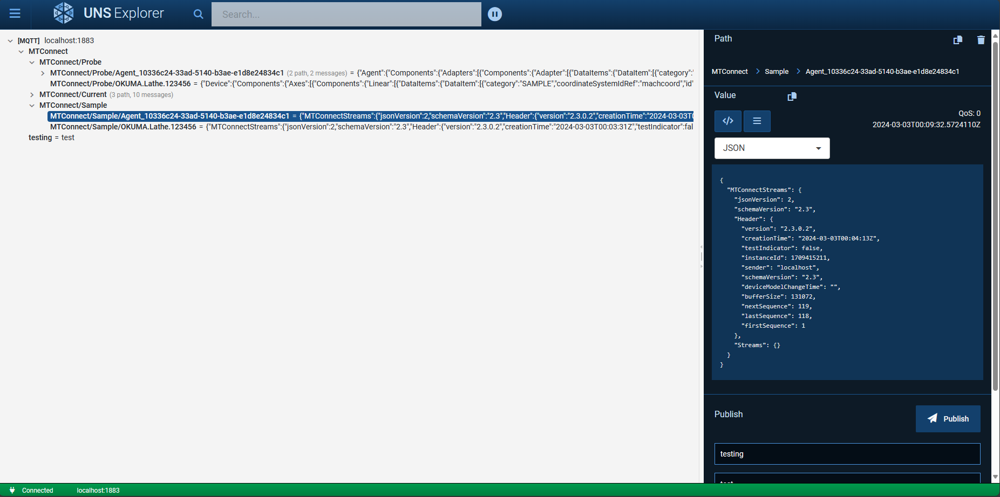
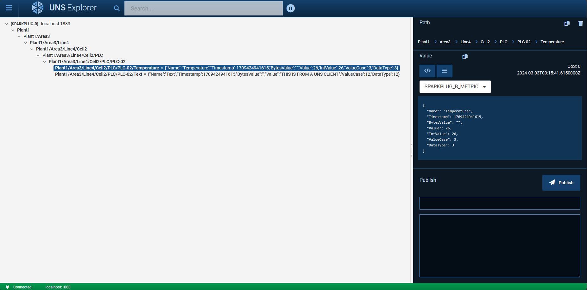

# Uns-Explorer
Client application to subscribe and publish to a Unified Namespace. Supports MQTT and Sparkplug B.

## Features
- Browser based
- Supports Sparkplug B decoding/encoding
- Work with Sparkplug B using Paths (instead of GroupId, NodeId, DeviceId)
- Built on .NET 8 using Blazor
- Uses the [UNS.NET](https://github.com/TrakHound/Uns.NET) libraries

# ToDo
- Finish Client page (Copy, Delete, and some of the other buttons aren't wired up yet)
- Finish Connection Configuration page
    - Add template configurations (ex. HiveMQ, etc.)
- Benchmark and optimize for performance. Should be close or better to MQTT Explorer app performance
- Add History functionality
- Add Publish capability for Sparkplug B
- Add Logging
- Add authentication?
- Add a way to configure Namespaces (ex. Adhoc vs. standardized). Possibly show descriptions?
- Support multiple simultaneous connections?